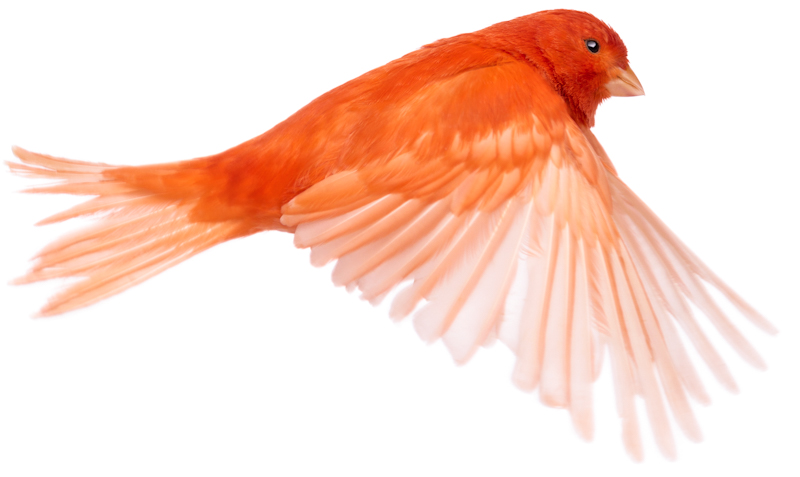
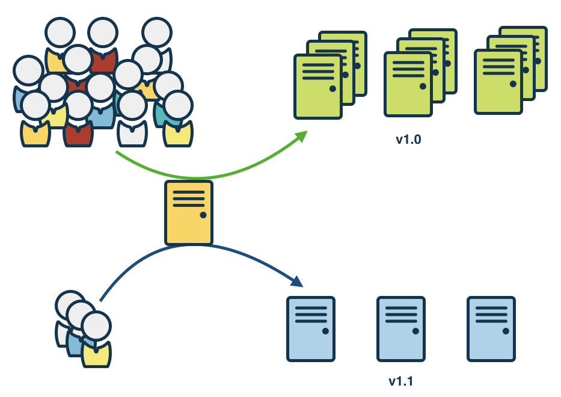
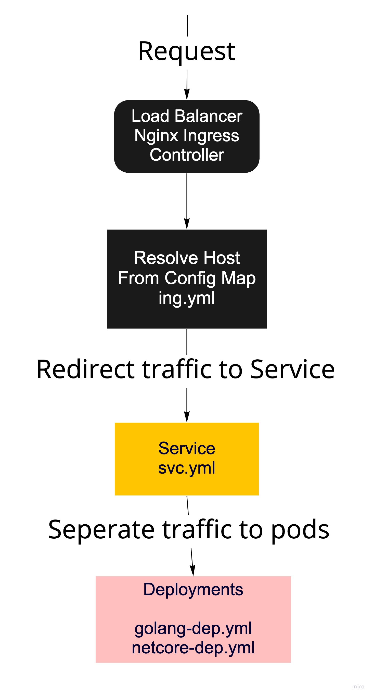
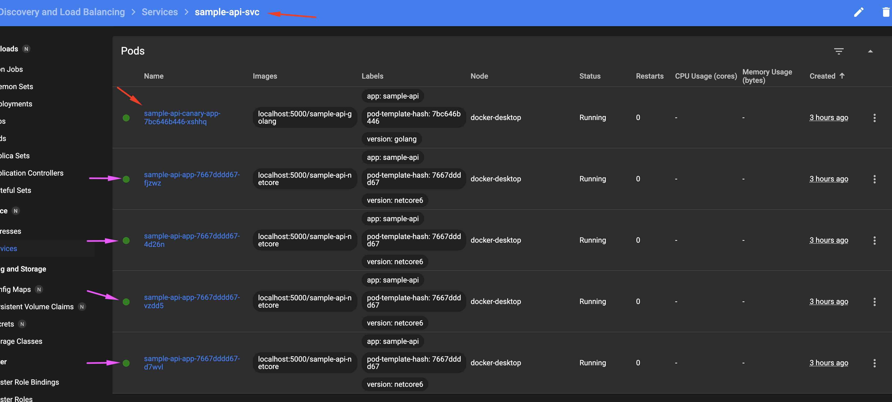
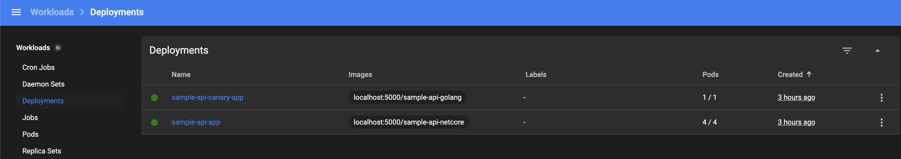

# Canary Deployment with K8s

Hello everyone, In this article, I want to talk about canary deployment with k8s, but first of all, what is canary deployment? I'll talk about that, and then I'll go over an example.


 <center></center>

Canary release is a technique to reduce the risk of introducing a new software version in production by slowly rolling out the change to a small subset of users before rolling it out to the entire infrastructure and making it available to everybody.

<hr>

Let's move on to the example now, first of all lets say we have an api with .net core 6, we will migrate our application to golang, but now the stable version is .net version, we have developed all our golang api responses as  .net version, we have completed the tests and we will publish it.


 <center></center>

However, we don't want to broadcast it directly, for example, there are 20 pods working with .net version in the production environment, we will put a few pods with golang, and monitor them.

<hr>

Let's talk a little bit about architecture


<center></center>

<hr> 

Let the application codes be as follows

## .Net 6 version (stable application)

```csharp 
var builder = WebApplication.CreateBuilder(args);

builder.Services.AddEndpointsApiExplorer();
builder.WebHost.UseUrls("http://+:8080");
var app = builder.Build();

var list = new[]
{
    "Hello", "From", "NetCore6"
};

app.MapGet("/", () =>
{
    
    return list.ToList();
})
.WithName("Get");

app.Run();
```


## GoLang version

```go
package main

import (
	"net/http"

	"github.com/labstack/echo/v4"
)

func main() {
	e := echo.New()
	e.GET("/", func(c echo.Context) error {
		var myarr [3]string
		myarr[0] = "Hello"
		myarr[1] = "From"
		myarr[2] = "GoLang"

		return c.JSON(http.StatusOK, myarr)
	})
	e.Logger.Fatal(e.Start(":8080"))
}
```

Both applications provide a list on the same endpoint, this is how we want it to be.


If we look at the files for k8s, it should look like this

ing.yml
```yml
apiVersion: extensions/v1beta1
kind: Ingress
metadata:
 name: sample-api-ing
 namespace: default
spec:
 rules:
 - host: sample-api.com
   http:
     paths:
       - path: /
         backend:
           serviceName: sample-api-svc
           servicePort: 8080
```


svc.yml
```yml
apiVersion: v1
kind: Service
metadata:
  name: sample-api-svc
  namespace: default
  labels:
    app: sample-api
spec:
  type: ClusterIP         <----
  selector:
    app: sample-api
  ports:
  - port: 8080
    name: "http"
    protocol: TCP
```


**type must be ClusterIP**


netcore-dep.yml
```yml
apiVersion: apps/v1
kind: Deployment
metadata:
  name: sample-api-app              <----
  namespace: default
spec:
  replicas: 4                       <----
  selector:
    matchLabels:
      app: sample-api
  strategy:
    type: RollingUpdate
    rollingUpdate:
      maxSurge: 1
      maxUnavailable: 20%
  template:
    metadata:
      labels:
        version: "netcore6"         <----
        app: sample-api
    spec:
      containers:
      - name:  sample-api
        image: localhost:5000/sample-api-netcore
        imagePullPolicy: Always
        ports:
        - containerPort: 8080
        env:
        - name: ASPNETCORE_URLS 
          value: http://*:8080
```

Warning !

There is a field name of version its equals "netcore6" for flag version

There is a field name of metadata --> name its equals "sample-api-app" for deployment name

golang-dep.yml
```yml
apiVersion: apps/v1
kind: Deployment
metadata:
  name: sample-api-canary-app         <----
  namespace: default
spec:
  replicas: 1                         <----
  selector:
    matchLabels:
      app: sample-api
  strategy:
    type: RollingUpdate
    rollingUpdate:
      maxSurge: 1
      maxUnavailable: 20%
  template:
    metadata:
      labels:
        version: "golang"             <----
        app: sample-api
    spec:
      containers:
      - name:  sample-api
        image: localhost:5000/sample-api-golang
        imagePullPolicy: Always
        ports:
        - containerPort: 8080
```

Warning !

There is a field name of version its equals "golang" for flag version

There is a field name of metadata --> name its equals "sample-api-canary-app" for deployment name


After these operations, k8s dashboard views will be as follows.

# Pods

 <center></center>


# Deployments

 <center></center>


The traffic coming through Nginx ingress will be directed to the service in svc.yml, the pods in the service will receive the traffic in turn, in this case 1 pod will have worked with golang and 4 pods with .net core 6.


Resources

https://martinfowler.com/bliki/CanaryRelease.html

https://phoenixnap.com/kb/kubernetes-canary-deployments